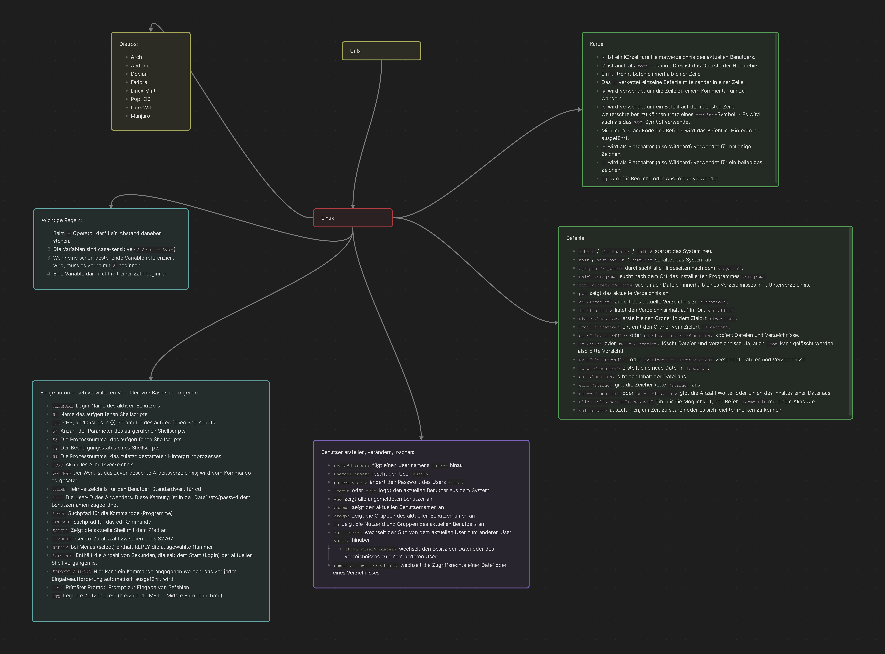

# m122-ap23a-Neslihan-Avsar

| Tag | Thema | Notizen und Resultate |
| --- | --- | --- |
| 1 | Linux Einführung | MD-01 geschrieben, WSL-Setup durchgeführt |
| 2 | Bash Grundlagen + Aufgaben | MD-02 und MD-03 geschrieben |
| 3 | Bash Grundlagen + Aufgaben | MD-03 erweitert, MD-04 geschrieben |
| 4 | Bash Aufgaben | MD-03 erweitert |
| 5 | Bash Aufgaben + LB1 | Zusammenfassung erstellt |
| 6 | LB2: Start | |
| 7 | LB2: Code | |
| 8 | LB2: Code | |
| 9 | LB2: Abgabe | |
| 10 | LB2: Abgabe | |

